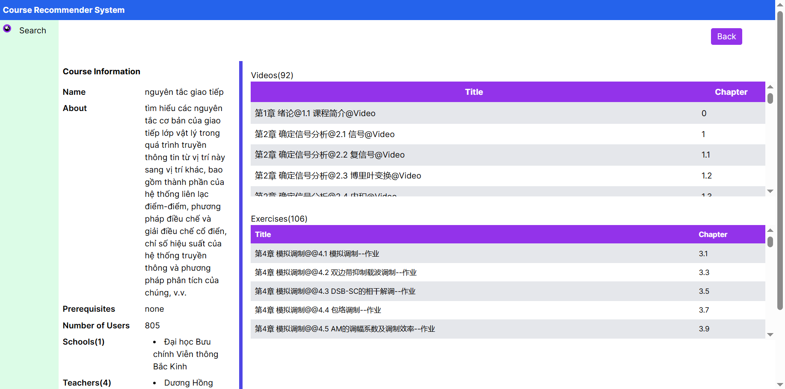

## Hướng dẫn tạo database

1. Cài đặt MySQL (Server, client command line)

2. Tạo tài khoản và database với thông tin như sau:

- Username: root
- Mật khẩu: 1234
- database name: mooccubex
- port: 3306 (default)

3. Mở Client command line và chạy lệnh:

```
charset utf8mb4;

source abosulte/path/to/database-preperation/sql-files/
create_table.sql

source abosulte/path/to/database-preperation/sql-files/
insert_data.sql
```

## Hướng dẫn chạy web:

1. Tạo conda env python 3.10, activate env này

2. Cài nodejs, `npm i`, `npm run dev`

UI:

**Index page**


**User info page**


**Course info page**

